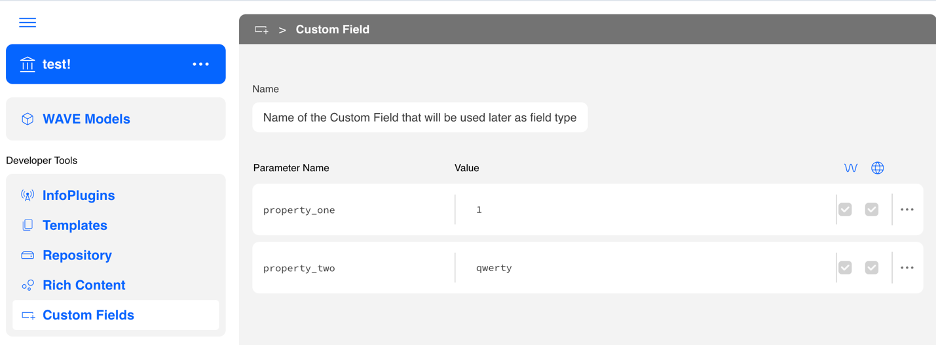

# 🚀 Developer Guide: Creating a Custom Field with MyWave UI

## 1. Clone the Starter Template
Begin by cloning the custom field starter template:

```
git clone https://github.com/mywave-me/mywave-ui-examples.git
cd mywave-ui-examples
```

### Prerequisites
Ensure you have the following installed:

- Node.js (v20.12.2)
- pnpm (v9.0.6)

If not, run the setup script:

```
./scripts/preinstall.sh
```

## 2. Install Dependencies
Navigate to the project directory and install the required dependencies:

```
cd examples/custom-field-react-starter
pnpm install
```

## 3. Explore the Starter Files
Open the project in your preferred code editor. Familiarize yourself with the following key files:

`src/myCustomField.tsx`: The main component where the custom field is defined.

`src/main.tsx`: The entry point that renders the CustomField component.

`index.html`: The HTML template that includes the root div (`<div id="root"></div>`).

## 4. 🛠️ Implement the Custom Field Configuration

Open or create `src/myCustomField.tsx`. This file is where you define your custom field logic.

Here’s a minimal working example of a custom text field:

```
import { AnyCustomFieldConfig } from '@mywave/ui-react';
import React from 'react';

const MyCustomTextField: AnyCustomFieldConfig = {
  type: 'my-custom-text',

  validate: (value: string) => {
    return value.length > 0;
  },

  validationMessage: 'This field cannot be empty.',

  renderField: ({ ref, onChange, field, onSubmit }) => {

    const value = field.getAnswer() ?? '';
    const props = field.getCustomFieldProps() as {
      placeholder?: string;
      label?: string;
    };
    return (
      <div style={{ padding: '1rem' }}>
        <label>{context.config.label}</label>
        <input
          type="text"
          placeholder={props.placeholder ?? ''}
          value={value ?? ''}
          onChange={(e) => {
            field.setAnswer(e.target.value); 
            onChange();
          }}
          onKeyDown={(e) => {
            if (e.key === 'Enter') {
              onSubmit(); 
            }
          }}
          placeholder={context.config.placeholder}
        />
      </div>
    );
  },

  renderAnswer: ({ value }) => {
    return <span>Your answer: {value}</span>;
  },
};

export default MyCustomTextField;
```

### 🧩 Breakdown of Key Elements

| Property	| Purpose |
|----|---|
|type	| type is the name of a custom field. It must be the same as the custom field name that has been set in the Innovation Hub (see screenshot in section 7 below) |
| hideSubmitButton| By default, there is a submit button for each interaction. Setting this property to true will hide the submit button and let you to implement your own button or functionality for submitting an answer|
|fullWidthInteraction| By default, the width of interaction is limited by the width of its container. Setting this to true will remove this restriction and an interaction will be rendered to a full width|
|showAnswer| Indicates whether to display the answer (optional)|
|validate	| A function that receives the value and returns true/false. |
|validationMessage	| Message shown when validation fails. |
|renderField	| renderField is a callback that provides necessary information to render UI for the field itself.<br><br>renderField should return a function that manipulates DOM. It takes three parameters:<br> - `ref` is React RefObject. ref.current is the DOM element where the field will be rendered in. <br> - `field` is the CustomField object. For more details see CustomField section of this guide <br> - `onSubmit` If the submit button is hidden, but you still need to submit an answer, manually call onSubmit to submit the interaction. Before calling onSubmit the answer should be set to the field with field.setAnswer(answer) <br><br> Other fields are:<br> - `autoFocus`	Should this field be auto-focused on render?<br> - `hasMultipleFields`		Are there other fields in this interaction?<br> - `onChange`	`(value: A) => void	Call` this to update the field’s value.|
|renderAnswer	| renderAnswer is a callback that provides necessary information for rendering UI for the Answer. <br> <br>renderAnswer should return a function that manipulates DOM. It takes two parameters:<br> - `ref` is React RefObject. ref.current is the DOM element where the field will be rendered in<br> - `field` is the CustomField object. For more details see CustomField section of this guide<br> - `hasMultipleFields` Are there other fields in this interaction?|

### Field Object
The CustomField object (refer to field above) that is passed to the renderField or renderAnswer functions, has the following methods:
|Method Name|	Description|
|---|---|
|setAnswer(value)	|use setAnswer to set the answer of the field|
|getAnswer()	|getAnswer returns the current answer that has been set on the field|
|getCustomFieldProps()	|Use getCustomFieldProps to get custom field properties that has been configured in the Innovation Hub|


## 5. 🧪 Register the Field
Open `src/main.tsx` to register the custom field within MyWave. 

In the starter repo, it is already done for the myCustomField.

```
<MyWaveUi
      sdk={sdk}
      sdkConfig={sdkConfig}
      options={{
        'history.enable': true,
        'login.enable': true,
        customFields: [myCustomField],
      }}
    />
```

## 6. Run the Application
Start the development server to see your custom field in action:

```
pnpm dev
```
Open your browser and navigate to http://localhost:6001 to interact with your custom field.

You can change the port by updating `vite.config.ts` to reflect something similar to below:
```
export default defineConfig({
  plugins: [react()],
  server: {
    port: 3000,
  },
})
```

## 7. Configure in Innovation Hub

When setting a CustomField in the Innovation Hub, you need to create a new one and name it, like this:


## Notes

- Ensure that the @mywave/ui-react package is installed and properly configured in your project.

- Customize the CustomField component further to handle other field types or validation logic as needed.

- Refer to the [MyWave UI Examples repository](https://github.com/mywave-me/mywave-ui-examples) for more examples and configurations.
