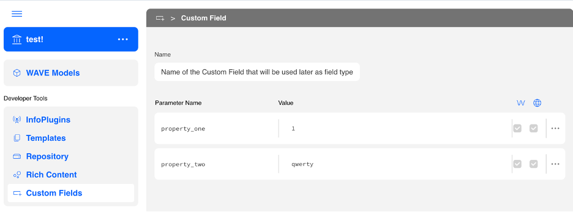

# MyWave UI React Starter

This template provides a minimal setup to get the MyWave UI working in a React application.

## Table of Contents
1. [Clone the Starter Template](#1-clone-the-starter-template)
2. [Install Dependencies](#2-install-dependencies)
3. [Explore the Starter Files](#3-explore-the-starter-files)
4. [Implement the Custom Field Configuration](#4-implement-the-custom-field-configuration)
5. [Register the Field](#5-register-the-field)
6. [Customization](#6-customization)
7. [Run the Application](#7-run-the-application)
8. [Configure in Innovation Hub](#8-configure-in-innovation-hub)

## 1. Clone the Starter Template
Begin by cloning the custom field starter template:

```bash
git clone https://github.com/mywave-me/mywave-ui-examples.git
cd mywave-ui-examples
```

### Prerequisites
Ensure you have the following installed:

- [Node.js](https://nodejs.org/) (v20.12.2)
- [pnpm](https://pnpm.io/) (v9.0.6)

If not, run the setup script:

```bash
./scripts/preinstall.sh
```

## 2. Install Dependencies

Navigate to the project directory and install the dependencies.

```bash
# Use one of the following commands based on your preferred package manager:
pnpm install
# or
npm install
# or
yarn install
```

Create your `.env` file at the root of the project (or simply rename the existing `.env.example` to `.env`) and add the required variables.

```bash
# ./.env

VITE_MYWAVE_API_URL=<MyWave backend platform URL>
VITE_MYWAVE_LOGIN_URL=<optional login service URL. Remove if not using>
VITE_MYWAVE_SIGNUP_URL=<optional signup service URL. Remove if not using>
```
> **Note:** Contact your MyWave administrator to obtain the required API URLs for the `.env` file.

## 3. Explore the Starter Files
Open the project in your preferred code editor. Familiarize yourself with the following key files:

`src/myCustomField.tsx`: The main component where the custom field is defined.

`src/main.tsx`: The entry point that renders the CustomField component.

`index.html`: The HTML template that includes the root div (`<div id="root"></div>`).

## 4. Implement the Custom Field Configuration

Open or create `src/myCustomField.tsx`. This file is where you define your custom field logic.

Here’s a minimal working example of a custom text field:

```typescript
import { AnyCustomFieldConfig } from '@mywave/ui-react';
import React from 'react';

const MyCustomTextField: AnyCustomFieldConfig = {
  type: 'my-custom-text-field',

  validate: (value: string) => {
    return value && value.trim().length > 0;
  },

  validationMessage: 'This field is required.',

  renderField: ({ ref, onChange, field, onSubmit }) => {

    const props = field.getCustomFieldProps() as {
      placeholder?: string;
      label?: string;
    };
    return (
      <div style={{ padding: '1rem' }}>
        {props.label && <label style={{ display: 'block', marginBottom: '4px' }}>{props.label}</label>}
        <input
          type="text"
          placeholder={props.placeholder ?? ''}
          onChange={(e) => {
            field.setAnswer(e.target.value); 
            onChange();
          }}
          onKeyDown={(e) => {
            if (e.key === 'Enter') {
              onSubmit(); 
            }
          }}
        />
      </div>
    );
  },

  renderAnswer: ({ field, ref }) => {
    return () => {
      if (ref.current) {
        const value = field.getCustomFieldData("value");
        ref.current.innerHTML = renderToString(<span style={{ fontStyle: 'italic' }}>{value ?? 'No answer provided'}</span>);
      }
    }
  }
};

export default MyCustomTextField;
```

### 🧩 Breakdown of Key Elements

| Property	| Purpose |
|----|---|
|type	| type is the name of a custom field. It must be the same as the custom field name that has been set in the Innovation Hub (see screenshot in section 7 below) |
| hideSubmitButton| By default, there is a submit button for each interaction. Setting this property to true will hide the submit button and let you to implement your own button or functionality for submitting an answer|
|fullWidthInteraction| By default, the width of interaction is limited by the width of its container. Setting this to true will remove this restriction and an interaction will be rendered to a full width|
|showAnswer| Indicates whether to display the answer (optional)|
|validate	| A function that receives the value and returns true/false. |
|validationMessage	| Message shown when validation fails. |
|renderField	| renderField is a callback that provides necessary information to render UI for the field itself.<br><br>renderField should return a function that manipulates DOM. It takes three parameters:<br> - `ref` is React RefObject. ref.current is the DOM element where the field will be rendered in. <br> - `field` is the CustomField object. For more details see CustomField section of this guide <br> - `onSubmit` If the submit button is hidden, but you still need to submit an answer, manually call onSubmit to submit the interaction. Before calling onSubmit the answer should be set to the field with field.setAnswer(answer) <br><br> Other fields are:<br> - `autoFocus`	Should this field be auto-focused on render?<br> - `hasMultipleFields`		Are there other fields in this interaction?<br> - `onChange`	`(value: A) => void	Call` this to update the field’s value.|
|renderAnswer	| renderAnswer is a callback that provides necessary information for rendering UI for the Answer. <br> <br>renderAnswer should return a function that manipulates DOM. It takes two parameters:<br> - `ref` is React RefObject. ref.current is the DOM element where the field will be rendered in<br> - `field` is the CustomField object. For more details see CustomField section of this guide<br> - `hasMultipleFields` Are there other fields in this interaction?|

### Field Object
The CustomField object (refer to field above) that is passed to the renderField or renderAnswer functions, has the following methods:
|Method Name|	Description|
|---|---|
|setAnswer(value)	|use setAnswer to set the answer of the field|
|getAnswer()	|getAnswer returns the current answer that has been set on the field|
|getCustomFieldProps()	|Use getCustomFieldProps to get custom field properties that has been configured in the Innovation Hub|


## 5. Register the Field
Open `src/main.tsx` to register the custom field within MyWave. 

In the starter repo, it is already done for the myCustomField.

```typescript
    <MyWaveUi
      sdk={sdk}
      sdkConfig={sdkConfig}
      options={{
        'history.enable': true,
        'login.enable': true,
        customFields: [myCustomField],
      }}
    />
```

## 6. Customization

In the `public` folder find `theme.css` file. This is the file where all styling customization can be done. 
Simply add css variables into the class `.MyWaveUI`.
Some of them, most commonly used, are already there. We also commented the purpose of those variables.

The whole list of variables used in the app can be found at the end of the file.
Simply move any of them into `.MyWaveUI` and redefine the value.

### Logo(s)

Logo is set in the same `theme.css` file:
- `--mw-landing-page-logo` this variable is responsible for the logo on the landing page
- `--mw-sidebar-logo` this variable is responsible for the logo on the left hand side panel

### Favicon

Update the `favicon.svg` file in the `public` folder. Ensure the file is in SVG format and optimized for web use.


## 7. Run the Application
When you are ready to build the app, run

```bash
# To build the app:
pnpm build
# or
npm run build
# or
yarn build
```

To run in dev mode
```bash
# To run in development mode:
pnpm dev
# or
npm run dev
# or
yarn dev
```

Open your browser and navigate to http://localhost:6001 to interact with your custom field.

You can change the port by updating `vite.config.ts` to reflect something similar to below:
```typescript
export default defineConfig({
  plugins: [react()],
  server: {
    port: 3000,
  },
})
```

## 8. Configure in Innovation Hub

When setting a CustomField in the Innovation Hub, you need to create a new one and name it, like this:


## Notes

- Ensure that the @mywave/ui-react package is installed and properly configured in your project.

- Customize the CustomField component further to handle other field types or validation logic as needed.

- You can include any number of custom fields as part of the MyWave UI

- Refer to the [MyWave UI Examples repository](https://github.com/mywave-me/mywave-ui-examples) for more examples and configurations.


