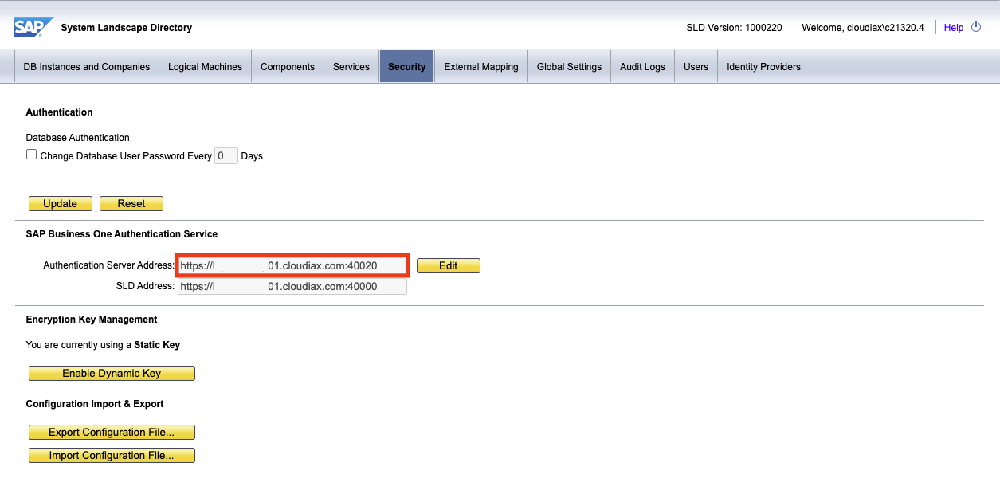
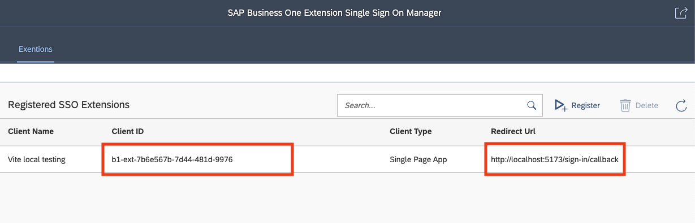

# MyWave with OIDC login example

This application demonstrates how to do OAuth2 login with an OIDC provider.

## Setup

To install all dependencies, run the following command:

```bash
pnpm install
```

## Local development

To run the example app locally for development purposes, run the following command:

```bash
pnpm dev
```

### Environment varialbes

This example requires some environment variables to be configured before it can be built or run. Please ensure you have created a `.env.local` or change `.env` file in the root directory with the following variables configured:

```
VITE_OIDC_AUTHORITY=<URL of the OIDC/OAuth2 provider>
VITE_OIDC_CLIENT_ID=<Your client application's identifier as registered with the OIDC/OAuth2>
VITE_OIDC_CLIENT_SECRET=<Your client application's secret as registered with the OIDC/OAuth2>
VITE_API_URL=<Your MyWave platform url>
VITE_LOGIN_URL=<Your MyWave login url>
```

### for SAP B1

To run the application against B1 as the OIDC provider, you should set the following environment variables

```
VITE_OIDC_AUTHORITY=<Authentication Server Address>/auth/realms/sapb1/
VITE_OIDC_CLIENT_ID=<OIDC Client ID>
VITE_OIDC_CLIENT_SECRET=
VITE_API_URL=<MyWave LB address>/mywave
VITE_LOGIN_URL=<MyWave LB address>/integration/api/sso/login
```

For example, if the "Authentication Server Address", "OIDC Client ID", and "MyWave LB address" for B1 are "https://sapb1.cloudiax.com:40020", "b1-ext-X", and "https://sapb1.app.mywave.me" respectively, the configuration in the `.env.local` file should be:

```
VITE_OIDC_AUTHORITY=https://sapb1.cloudiax.com:40020/auth/realms/sapb1/
VITE_OIDC_CLIENT_ID=b1-ext-X
VITE_OIDC_CLIENT_SECRET=
VITE_API_URL=https://sapb1.app.mywave.me/mywave
VITE_LOGIN_URL=https://sapb1.app.mywave.me/integation/api/sso/login
```

B1 does not ask for OIDC client secret, so you should leave `VITE_OIDC_CLIENT_SECRET` empty.

### Instructions to get <Authentication Server Address> and <Client ID> on SAP B1.

`<Authentication Server Address>`
  
1. Sign in to System Landscape Directory
2. Go to **Security** tab
3. You will find **Authentication Server Address** under SAP Business One Authentication Service



`<OIDC Client ID>`

1. Sign in to SAP Business One Extension Single Sign On Manager
2. Register a SSO client which Redirect Url is `http://localhost:5173/sign-in/callback`
3. You will find `Client ID` in the client list




## Build the example app

Build the example app for deployment by running the following command:

```bash
pnpm build
```

## Customization

In the `public` folder find `theme.css` file. This is the file where all styling customization can be done. 
Simply add css variables into the class `.MyWaveUI`.
Some of them, most commonly used, are already there. We also commented the purpose of those variables.

The whole list of variables used in the app can be found at the end of the file.
Simply move any of them into `.MyWaveUI` and redefine the value.

### Logo(s)

Logo is set in the same `theme.css` file:
- `--mw-landing-page-logo` this variable is responsible for the logo on the landing page
- `--mw-sidebar-logo` this variable is responsible for the logo on the left hand side panel

### Favicon

Update `favicon.svg` file in the `public` folder and the app will use your updated favicon.
